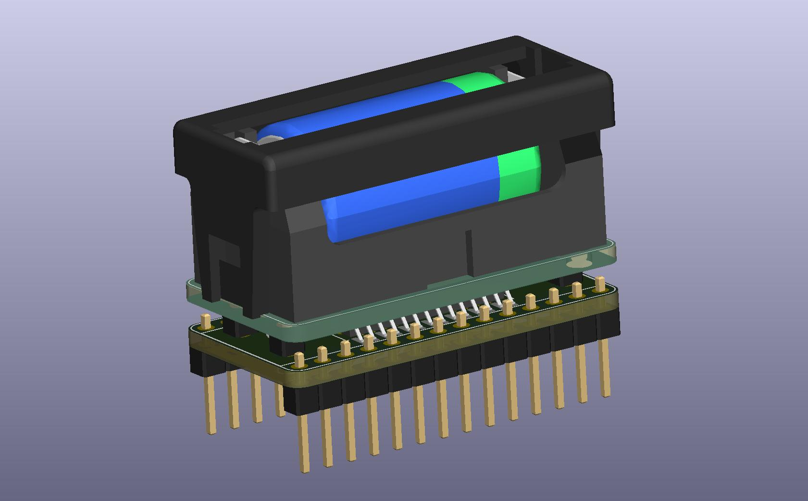

# LongTimeKeeper

**LongTimeKeeper** is a drop-in replacement for the STMicroelectronics **M48T58 / M48T58Y TIMEKEEPER® NVRAM** (8 K × 8 battery-backed SRAM with real-time clock) in its 28-pin 600 mil PCDIP "CAPHAT" package.

The original PCDIP part has its lithium cell sealed in the package. When the cell runs flat, the chip loses both the clock and the SRAM contents, and the whole IC has to be replaced. LongTimeKeeper uses the surface-mount **M48T58Y in SOH28** instead. That package normally takes an ST SNAPHAT® battery/crystal top. Here the SNAPHAT is replaced by:

- a discrete **32.768 kHz crystal**, and
- a **user-replaceable 1/2 AA 3.6 V lithium cell** in a Keystone holder. The cell is a Tadiran **SL-850/S** from the SL-800 XOL (eXtended Operating Life) series, rated 1.2 Ah. This series has a very low self-discharge rate.

The cell has a much larger capacity than the original internal cell, and you can swap it without desoldering anything or losing the board's socketed footprint.

## How it works

The adapter is a stack of two PCBs:

| Board | KiCad project | Role |
|---|---|---|
| **Bottom** | `LongTimeKeeper_Bottom/LongTimekeeper_Bottom.kicad_pro` | DIP-28 (15.24 mm) pin-out that plugs into the original M48T58 socket. It carries the M48T58Y-SOH28 (U7), the 32.768 kHz crystal (Y1) on the SNAPHAT X1/X2 contacts, and a 4-pad battery connector (BT1) wired to the SNAPHAT BAT+/BAT- contacts. |
| **Up** (battery) | `LongTimeKeeper_Up/TimekeeperBat_Up.kicad_pro` | Carries the Keystone 108 1/2 AA holder with its 108C cover (BT1). It connects to the bottom board through 4 × 2.54 mm pins (J1, `Battery_PCB` footprint), which also hold the two boards together mechanically. |

Signal mapping: every DIP-28 pin of the original package (A0–A12, DQ0–DQ7, Ē1, E2, Ḡ, W̄, FT, VCC, VSS) is routed 1:1 to the matching pin of the SOH28 device, so the host system sees an unmodified M48T58. Both boards are 2-layer, 1.6 mm FR-4, and fit within the original DIP-28 footprint (about 18.4 × 36.3 mm).

The projects were created with **KiCad 10**.

## Bill of materials

Prices are **indicative, VAT included (TTC, 20 % French VAT), for 1 unit**, checked in October 2026 at DigiKey France, except where noted. Distributor prices change often, so check them before ordering.

| Qty | Ref. | Description | Manufacturer | Manufacturer P/N | Unit price TTC | Total TTC |
|---:|---|---|---|---|---:|---:|
| 1 | U7 | TIMEKEEPER® NVRAM 64 Kbit (8K×8) + RTC, 5 V, SOH28 (SNAPHAT socket) | STMicroelectronics | **M48T58Y-70MH1F** | 24.97 € | 24.97 € |
| 1 | Y1 | Crystal 32.768 kHz, ±20 ppm, 12.5 pF, SMD 3.2 × 1.5 mm (3215) | Epson | **FC-135 32.7680KA-A3** (Q13FC1350000400) | 2.81 € | 2.81 € |
| 1 | BT1 (Up) | Battery holder, 1 × 1/2 AA, through-hole | Keystone Electronics | **108** | 1.52 € | 1.52 € |
| 1 | BT1 (Up) | Battery holder cover, 1/2 AA | Keystone Electronics | **108C** | ≈ 0.58 € ¹ | 0.58 € |
| 1 | — | Lithium cell Li-SOCl₂ 3.6 V 1.2 Ah, 1/2 AA (ER14250), standard terminals (no tabs), **SL-800 XOL – extended operating life** (very low self-discharge) | Tadiran | **SL-850/S** | 14.56 € ⁴ | 14.56 € |
| 2 | U2 | Male pin header 1 × 14, 2.54 mm, vertical (DIP-28 legs) | Würth Elektronik | **61301411121** (WR-PHD) | ≈ 1.10 € ² | 2.20 € |
| 4 | J1 / BT1 | Single 2.54 mm pins for the board-to-board link (cut from a 1 × 40 strip) | Würth Elektronik | **61304011121** (WR-PHD 1 × 40) | ≈ 2.20 € ² (strip) | 2.20 € |
| | | | | | **Subtotal components** | **≈ 48.86 €** |
| 1 | — | PCB "Bottom", 2 layers, 1.6 mm, 18.4 × 36.3 mm (`Gerber/LongTimekeeper_Bottom_Gerber.zip`) | JLCPCB | — | ≈ 1.30 € ³ | 1.30 € |
| 1 | — | PCB "Up", 2 layers, 1.6 mm, 18.4 × 36.3 mm (`Gerber/TimekeeperBat_Up_Gerber.zip`) | JLCPCB | — | ≈ 1.30 € ³ | 1.30 € |
| | | | | | **Total per module** | **≈ 51.46 €** |

¹ TME price (0.48 € excl. VAT, sold in packs of 10).
² Estimated.
³ Per board, from a batch of 5 at JLCPCB, with shipping and VAT included. See [PCB cost estimate](#pcb-cost-estimate).
⁴ 1001Piles price (France, VAT included). Order the `/S` variant (standard terminals, no solder tabs) to fit the Keystone 108 holder. The `/T` variant has solder tabs and does not fit.

### PCB cost estimate

Both boards are small (about 18.4 × 36.3 mm, 6.7 cm² each), 2-layer, 1.6 mm FR-4, and use standard rules. They qualify for the cheapest prototype offers. Prices are indicative and VAT included (20 %). The two designs are ordered as two separate jobs.

| Fab | Order | Fabrication | Shipping + VAT (est.) | Total TTC | Per module (Bottom + Up) |
|---|---|---|---:|---:|---:|
| **JLCPCB** (China) | 5 × Bottom + 5 × Up, HASL, green | 2 × ~2 USD ≈ 3.70 € | ≈ 9 € (economy shipping) | **≈ 13 €** | **≈ 2.60 €** |
| **AISLER** (Germany) | 3 × Bottom + 3 × Up, 2-layer "Budget" | 2 × (12 € job fee + 3 × 6.7 cm² × 0.067 €/cm²) ≈ 26.70 € excl. VAT | included | **≈ 32 €** | **≈ 10.70 €** |

JLCPCB is the cheapest option, but the low price is mostly lost if you order only one module, because shipping is a fixed cost. AISLER is about four times more expensive per module, but it ships faster within the EU and charges no import fees. Use a quote calculator for an exact price: some options increase it, such as ENIG finish (flatter pads, which make the SOH28 easier to solder), a non-green soldermask or express shipping.

### Notes on component choice

- **Crystal:** the schematic only specifies "32.768 kHz" on a 3215 footprint. The M48T58 datasheet does not give a load capacitance for the SNAPHAT crystal. Check the clock accuracy after assembly, and if needed try a lower-load (6–7 pF) 3215 crystal.
- **Battery:** use the Tadiran **SL-850/S** long-life cell (SL-800 series), not a standard-series cell such as the TL-5902. Its very low self-discharge rate suits a back-up that only draws a few µA for many years. The footprint and 3D model use the 1/2 AA (ER14250) size. Use a 3.6 V **primary** lithium cell. Do **not** use a rechargeable 3.7 V Li-ion 14250 cell, because its voltage is too high for the VBAT input.
- **DIP legs:** standard square header pins match the 3D model. Turned (machined) pins are gentler on the original socket.

## Assembly hints

1. Solder Y1 and U7 (SOH28) on the bottom board. Do **not** wave-solder the SOH28 package (see the ST datasheet).
2. Fit the two 1 × 14 headers on the bottom board, with the long pins pointing down, to form the DIP-28 legs.
3. Solder the Keystone 108 holder on the Up board, then the 4 link pins. Stack the Up board on the bottom board and solder the pins.
4. Insert the SL-850/S cell with the polarity marked on the holder, then snap on the 108C cover.
5. Plug the module into the original M48T58 socket, with pin 1 at the notched end.

## Datasheets

- [M48T58 / M48T58Y – STMicroelectronics](Datasheet/M48T58.pdf)
- [Keystone 108 battery holder](Datasheet/108-745412.pdf)
- [Keystone 108C cover](Datasheet/08C-745621.pdf)
- [Tadiran SL-850 (XOL – extended operating life)](Datasheet/tadiran_sl-850.pdf). This page is taken from the Tadiran Lithium Batteries Product Data Catalogue and also shows the SL-861.
- [Tadiran TL-5902](Datasheet/tadiran_tl5902-1214159.pdf). This is the standard-series datasheet, kept for reference.
